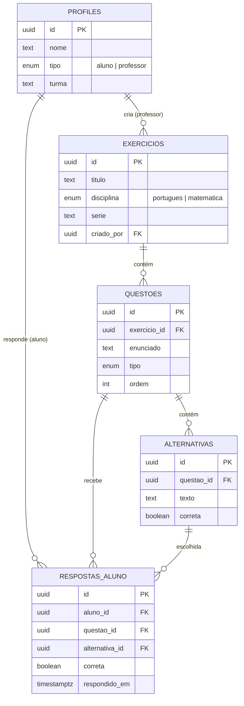

# Modelo de dados — Aprende+

Diagrama entidade-relacionamento das tabelas criadas em `backend/supabase/schema.sql`.

A view `resultados` agrega `respostas_aluno` por aluno/exercício (acertos, total respondido, percentual) — é o que alimenta o dashboard de acompanhamento do professor.

## Como aplicar no Supabase

1. Crie um projeto em [supabase.com](https://supabase.com) (gratuito).
2. Vá em **SQL Editor** → **New query**.
3. Cole o conteúdo de `backend/supabase/schema.sql` e clique em **Run**.
4. Em **Project Settings > API**, copie a `Project URL` e a `anon public key`.
5. Cole essas informações no `backend/.env` (veja `backend/.env.example`).

## Segurança (RLS)

Todas as tabelas têm Row Level Security ativado:
- **Aluno**: só lê/escreve as próprias respostas; lê exercícios e questões.
- **Professor**: além disso, cria/edita seus próprios exercícios e vê o desempenho de todos os alunos (necessário para o acompanhamento pedagógico).
